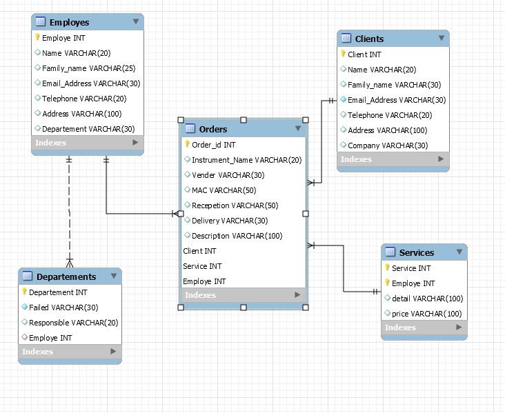
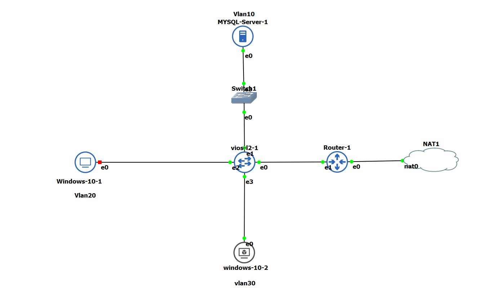
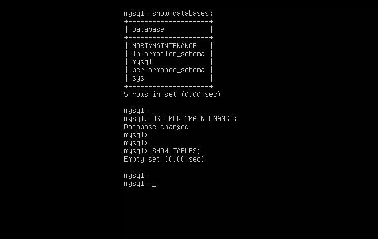
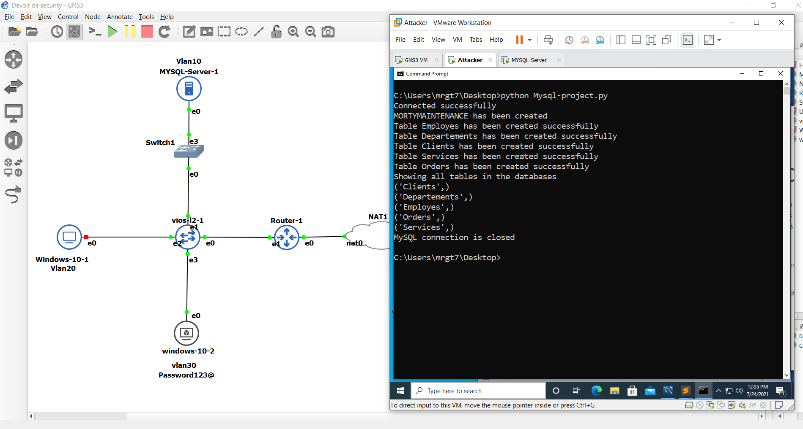
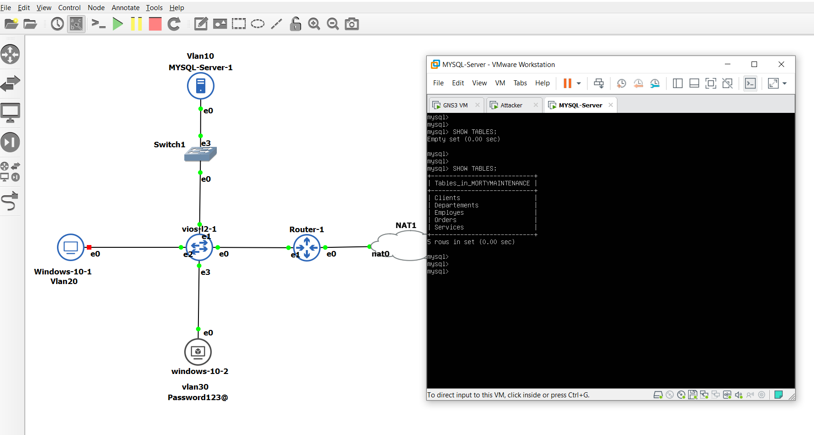
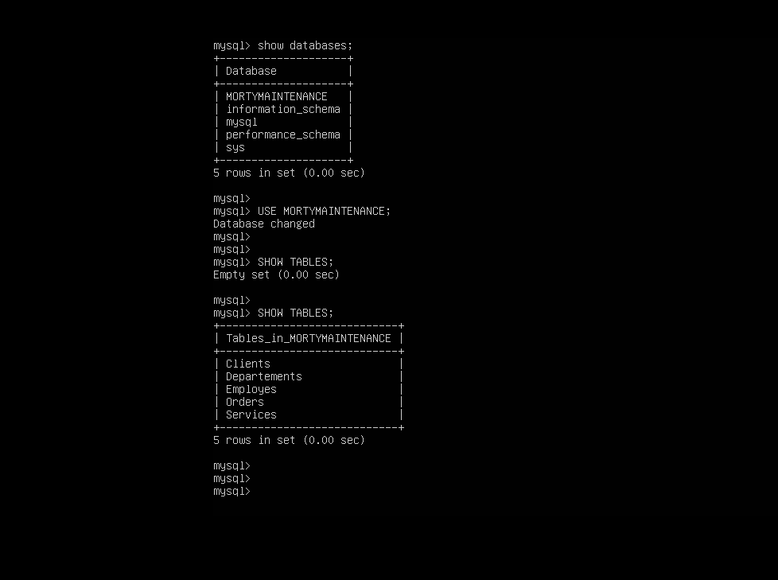
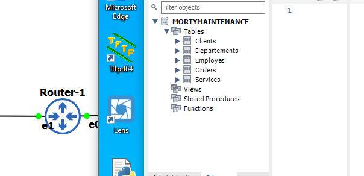
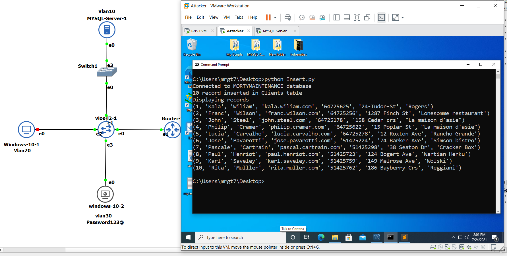
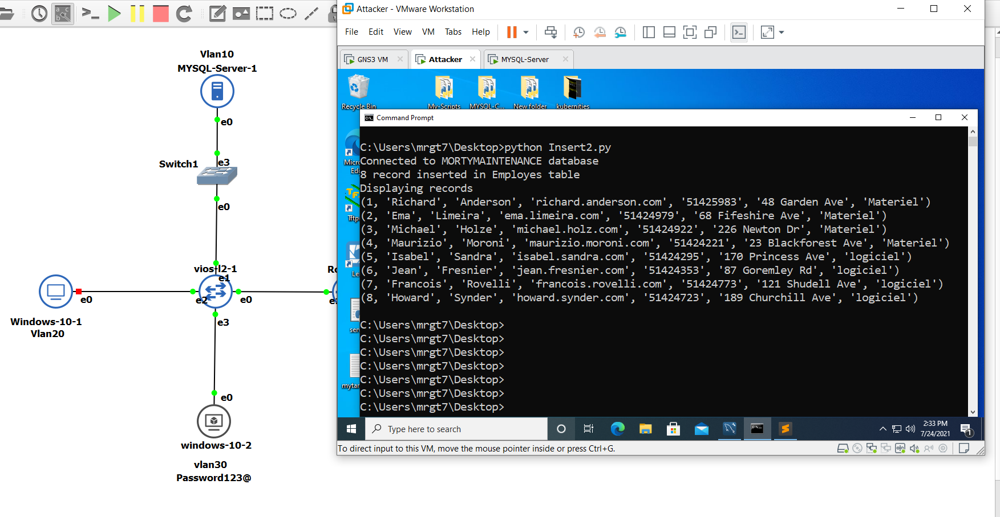

# MYSQL-PYTHON-SCRIPT-PROJECT

# :zap: Mortimaintenance is a company who repares network supplies:zap:

:star: In this project we are going to create the database of this company with tables and insrte the data into each table, and do some queries.


## :zap: This is the schema of our Database :zap:

## 

##
## :zap: And this is our database location on our topology :zap:

##



##

:zap: We are going to use the windows 10 computer to manage our database on Ubuntu server located on the different networks using python script :zap:

##


##
##


##

##
```python
import mysql.connector as mysql
from mysql.connector import Error

host = "10.10.10.1"
user = 'morty'
password = "Morteza123@$"

try:
    db = mysql.connect(host=host, user=user, password=password)
    print("Connected successfully")
except Exception as e:
    print(e)
    print("Failed to connect")


# Creating a database 

try:
    command_handler = db.cursor()
    command_handler.execute("CREATE DATABASE IF NOT EXISTS MORTYMAINTENANCE;")
    print("MORTIMAINTENANCE has been created ")

except Exception as e:
    print(e)
    print("Failed to connect")

try:
    command_handler = db.cursor()
    command_handler.execute("USE MORTYMAINTENANCE ;")


    command_handler.execute("CREATE TABLE IF NOT EXISTS Employes (Employe INT AUTO_INCREMENT PRIMARY KEY, \
        Name VARCHAR(20), Family_name VARCHAR(25), Email_Address VARCHAR(30), Telephone VARCHAR(20), \
        Address VARCHAR(100), Departement VARCHAR(30), UNIQUE (Email_Address, telephone))")
    print ("Table Employes has been created successfully ")


    command_handler.execute("CREATE TABLE IF NOT EXISTS Departements (Departement INT AUTO_INCREMENT PRIMARY KEY, \
        Failed VARCHAR(30) NOT NULL, Responsible VARCHAR(20), Employe INT, FOREIGN KEY (Employe) REFERENCES Employes(Employe))")
    print ("Table Departements has been created successfully ") 


    command_handler.execute("CREATE TABLE IF NOT EXISTS Clients (Client INT AUTO_INCREMENT PRIMARY KEY, \
        Name VARCHAR(20), Family_name VARCHAR(30), Email_Address VARCHAR(30) NOT NULL UNIQUE, Telephone VARCHAR(20), \
        Address VARCHAR(100), Company VARCHAR(30))")
    print ("Table Clients has been created successfully ")


    command_handler.execute("CREATE TABLE IF NOT EXISTS Services (Service INT AUTO_INCREMENT, Employe INT, \
        detail VARCHAR(100), price VARCHAR(100), PRIMARY KEY (Service, Employe))")
    print ("Table Services has been created successfully ")


    command_handler.execute("CREATE TABLE IF NOT EXISTS Orders (Order_id INT AUTO_INCREMENT, Instrument_Name VARCHAR(20), \
    Vender VARCHAR(30), MAC VARCHAR(50), Recepetion VARCHAR(50), Delivery VARCHAR(30), Description VARCHAR (100), Client INT, \
    Service INT, Employe INT, \
        PRIMARY KEY (Order_id, Client, Service, Employe), \
        FOREIGN KEY (Service) REFERENCES Services(Service), \
        FOREIGN KEY (Employe) REFERENCES Employes(Employe), \
        INDEX client_ind (Client), CONSTRAINT commande_ibfk_1 FOREIGN KEY (Client) REFERENCES Clients(Client) ON DELETE CASCADE)")
    print ("Table Orders has been created successfully ")


    command_handler.execute("SHOW TABLES ;")
    print ("Showing all tables in the databases")
    for table in command_handler:
        print(table)


except Exception as e:
    print("Table could not be created ")
    print(e)


finally:
    if db.is_connected():
        command_handler.close()
        db.close()
        print("MySQL connection is closed")
```

##

##



##

##



##

##


##


##



##

##



##

##


##

##


##

##



##

##


##
```python
import mysql.connector as mysql
from mysql.connector import Error

host = "10.10.10.1"
user = 'morty'
password = "Morteza123@$"


try:
    db1 = mysql.connect(host=host, user=user, password=password, database="MORTYMAINTENANCE")
    print("Connected to MORTYMAINTENANCE database")

except Exception as e:
    print("Could not connect to MORTYMAINTENACE ")
    print(e)

try:
    command_handler = db1.cursor()
    query = """INSERT INTO Clients(Name,Family_name,Email_Address,Telephone,Address,Company) \
    VALUES (%s, %s, %s, %s, %s, %s)"""
    query_vals = [( 'Kala', 'Wiliam', 'kala.wiliam.com', 64725625, '24-Tudor-St', 'Rogers'), \
    ('Franc', 'Wilson', 'franc.wilson.com', 64725256, '1287 Finch St', 'Lonesomme restaurant'), \
    ('John', 'Steel', 'john.steel.com', 64725178, '158 Cedar crs', "La maison d'asie"), \
    ( 'Philip', 'Cramer', 'philip.cramer.com', 64725622, '15 Poplar St', "La maison d'asie"), \
    ( 'Lucia', 'Carvalho', 'lucia.carvalho.com', 64725278, '12 Roxton Ave', "Rancho Grande"), \
    ( 'Jose', 'Pavarotti', 'jose.pavarotti.com', 51425224, '74 Barker Ave', "Simson bistro"), \
    ( 'Pascale', 'Cartrain', 'pascal.cartrain.com', 51425298, '38 Seaton Dr', "Cracker Box"), \
    ( 'Paul', 'Henriot', 'paul.henriot.com', 51425723, '124 Bogert Ave', "Wartian Herku"), \
    ( 'Karl', 'Saveley', 'karl.saveley.com', 51425759, '149 Melrose Ave', "Wolski"), \
    ( 'Rita', 'Mulller', 'rita.muller.com', 51425762, '186 Bayberry Crs', "Reggiani")

    ]


    command_handler.executemany(query,query_vals)
    db1.commit()
    print(command_handler.rowcount, "record inserted in Clients table")


except Exception as e:
    print("Table could not be created ")
    print(e)


command_handler.execute("SELECT * FROM Clients")
records = command_handler.fetchall()
print("Displaying records")
for record in records:
    print(record)

```
##


##



##
##
```python
import mysql.connector as mysql
from mysql.connector import Error

host = "10.10.10.1"
user = 'morty'
password = "Morteza123@$"


try:
    db1 = mysql.connect(host=host, user=user, password=password, database="MORTYMAINTENANCE")
    print("Connected to MORTYMAINTENANCE database")

except Exception as e:
    print("Could not connect to MORTYMAINTENACE ")
    print(e)

try:
    command_handler = db1.cursor()
    query = """INSERT INTO Employes(Name,Family_name,Email_Address,Telephone,Address,Departement) \
    VALUES (%s, %s, %s, %s, %s, %s)"""
    query_vals = [( 'Richard', 'Anderson', 'richard.anderson.com', 51425983, '48 Garden Ave', "Materiel"), \
    ( 'Ema', 'Limeira', 'ema.limeira.com', 51424979, '68 Fifeshire Ave', "Materiel"), \
    ( 'Michael', 'Holze', 'michael.holz.com', 51424922, '226 Newton Dr', "Materiel"), \
    ( 'Maurizio', 'Moroni', 'maurizio.moroni.com', 51424221, '23 Blackforest Ave', "Materiel"), \
    ( 'Isabel', 'Sandra', 'isabel.sandra.com', 51424295, '170 Princess Ave', "logiciel"), \
    ( 'Jean', 'Fresnier', 'jean.fresnier.com', 51424353, '87 Goremley Rd', "logiciel"), \
    ( 'Francois', 'Rovelli', 'francois.rovelli.com', 51424773, '121 Shudell Ave', "logiciel"), \
    ( 'Howard', 'Synder', 'howard.synder.com', 51424723, '189 Churchill Ave', "logiciel")

    ]


    command_handler.executemany(query,query_vals)
    db1.commit()
    print(command_handler.rowcount, "record inserted in Employes table")


except Exception as e:
    print("Table could not be created ")
    print(e)


command_handler.execute("SELECT * FROM Employes")
records = command_handler.fetchall()
print("Displaying records")
for record in records:
    print(record)

```
##


##



##
