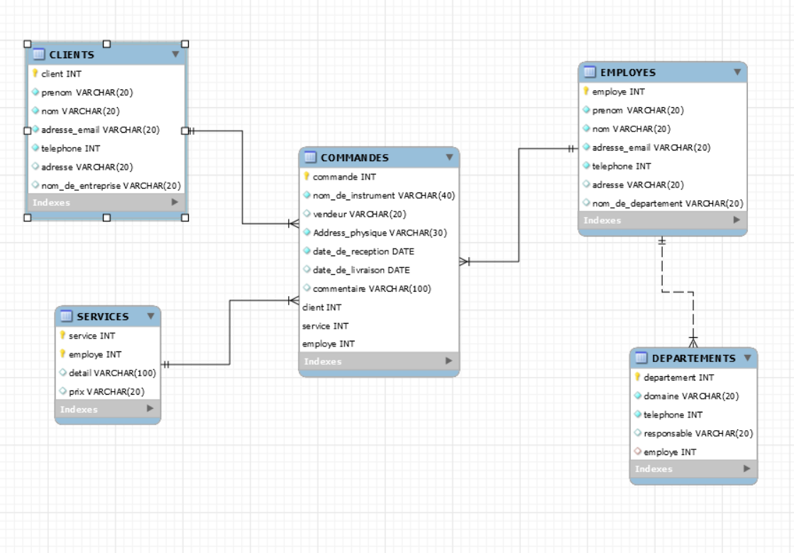
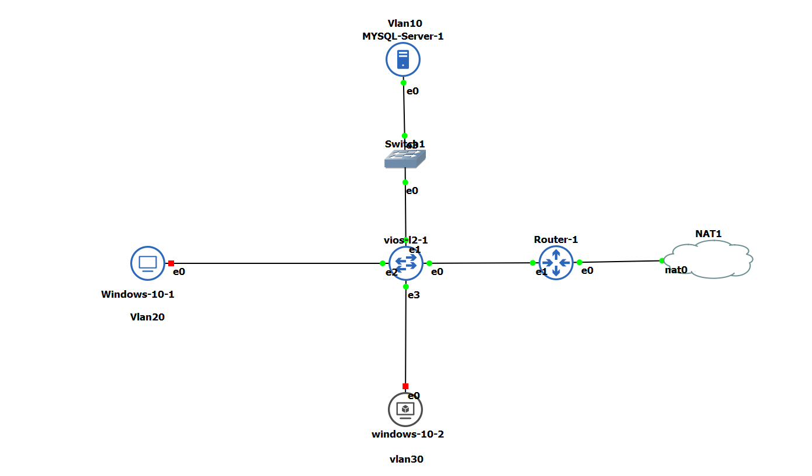

# MYSQL-PYTHON-SCRIPT-PROJECT

# :zap: Mortimaintenance is a company who repares network supplies:zap:

:star: In this project we are going to create the database of this company with tables and insrte the data into each table, and do some queries.

## :zap: This is the schema of our Database :zap:

## 

##
## :zap: And this is our database location on our topology :zap:

##

##

